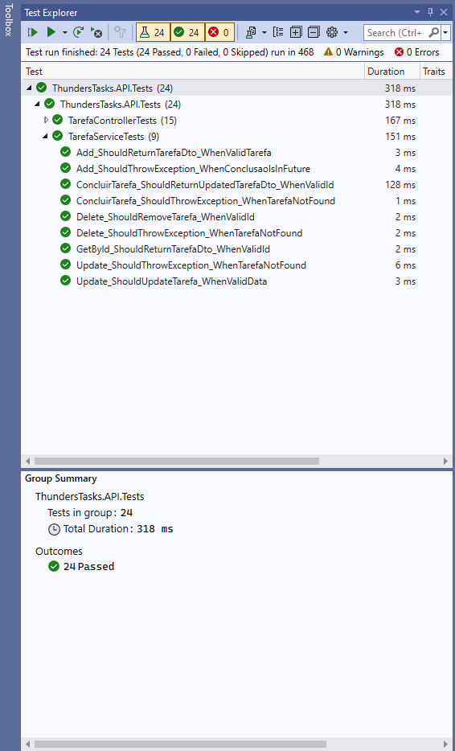

# Nome do Projeto

Tarefa: Desenvolver um CRUD utilizando API REST, seguindo boas práticas de programação. O objeto do CRUD será uma lista de tarefas.

## Tecnologias Utilizadas

- .NET 8
- C#
- Entity Framework Core
- AutoMapper
- SQL Server 2019
- Docker
- Domain Driven Design
- xUnit (para testes)

## Pré-requisitos

Antes de rodar o projeto, você precisa ter as seguintes ferramentas instaladas:

- [Visual Studio](https://visualstudio.microsoft.com/) ou [Visual Studio Code](https://code.visualstudio.com/)
- [.NET SDK](https://dotnet.microsoft.com/download)
- [Docker](https://www.docker.com/get-started)

## Instalação

### Usando Docker

Para rodar o projeto com Docker, siga as instruções abaixo. Isso irá configurar o projeto em um contêiner Docker, junto com qualquer dependência necessária (como o banco de dados).

1. Clone o repositório:
   git clone https://github.com/jeansantos77/ThundersTasks.git
2. Entrar no CMD
3. Entrar na pasta ThundersTasks e executar o comando para criar os containers
	docker compose up --build -d

4. Dentro da pasta ThundersTasks\ThundersTasks.API.Infra.Data executar o comando para rodar a migration
    dotnet ef database update

5. Abrir o swagger no navegador através da URL
    http://localhost:8080/swagger/index.html

## Tests

### Cobertura

Dentro da pasta ThundersTasks\ThundersTasks.API.Tests\Coverage tem a imagem do relatório gerado da cobertura de testes. A mesma pode ser visualizada abaixo:

### Testes Passed

